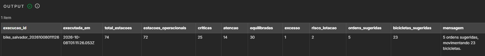
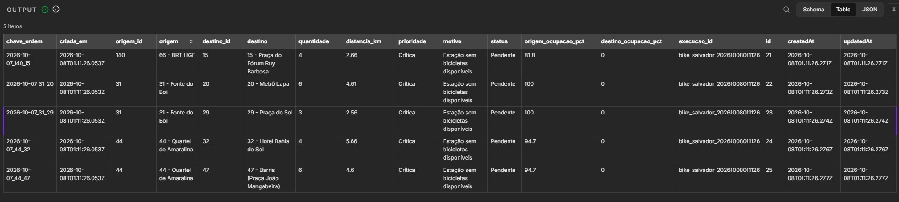
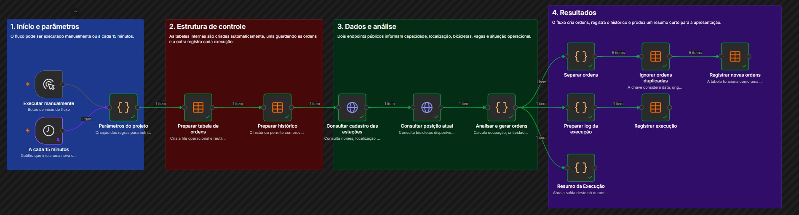

# Automação de rebalanceamento - Bikes Itaú

---

## Objetivo

MVP low-code desenvolvido no n8n para apoiar a priorização do rebalanceamento das estações do Bike Itaú em Salvador. A automação consulta a disponibilidade atual das estações, identifica pontos com falta ou excesso de bicicletas e sugere movimentações entre estações próximas visando reduzir o trabalho manual de análise das estações.

## Fonte dos dados

O projeto utiliza dois endpoints públicos no padrão GBFS:

- `station_information`: cadastro, localização e capacidade das estações;
- `station_status`: disponibilidade de bicicletas, vagas e situação operacional.

Fonte: [GBFS Bike Itaú Salvador](https://salvador.publicbikesystem.net/customer/gbfs/v3.0/gbfs.json)

## Resultado da automação

O fluxo classifica a situação das estações, seleciona origens com saldo disponível e sugere destino, quantidade, distância e prioridade de cada movimentação. As ordens são registradas em uma tabela operacional, enquanto cada execução gera um resumo para acompanhamento. As validações impedem duplicidade para que recomendações idênticas não são abertas novamente no mesmo dia.

Em uma execução de validação realizada em 7 de outubro de 2026, foram consultadas 74 estações, das quais 72 estavam operacionais e 25 foram classificadas como críticas. O processo registrou cinco ordens, totalizando a movimentação sugerida de 23 bicicletas representando o momento da consulta.





## Fluxo da solução

1. O fluxo é iniciado manualmente ou pode ser automatizado para rodar a cada 15 minutos.
2. Os dados de cadastro e disponibilidade são consultados na API.
3. Estações indisponíveis são retiradas da análise.
4. A ocupação e a criticidade de cada estação são calculadas.
5. O processo procura uma estação doadora próxima para cada destino crítico.
6. Uma quantidade de bicicletas é sugerida.
7. As novas ordens e o resumo da execução são armazenados no n8n.



## Estrutura do projeto

```text
rebalanceamento_bikes_itau/
├── docs/
├── images/
├── scripts/
├── src/
├── tests/
├── workflows/
├── .gitignore
├── LICENSE
├── package.json
└── README.md
```

---

## Regras do MVP

| Regra | Valor inicial |
|---|---:|
| Estação crítica | Até 15% de ocupação |
| Estação em atenção | Acima de 15% e abaixo de 30% |
| Estação doadora | Acima de 80% |
| Risco de lotação | Acima de 90% |
| Reserva mínima da doadora | 40% da capacidade |
| Alvo da estação de destino | 50% da capacidade |
| Transferência por ordem | De 2 a 8 bicicletas |
| Distância máxima | 8 km |

As regras completas estão em [docs/REGRAS_DE_NEGOCIO.md](docs/REGRAS_DE_NEGOCIO.md).

## Como reproduzi-lo

1. Execute `npm test` para validar as regras e a estrutura do workflow.
2. Execute `npm run validar-api` para consultar os dados atuais e visualizar uma amostra das recomendações.
3. No n8n, importe o arquivo `workflows/bike_itau_rebalanceamento.json`.
4. Faça uma execução manual na aba de "editor" para criar as tabelas e conferir as saídas.

## Limitações

- O feed informa a disponibilidade atual, mas não traz o histórico de viagens.
- Os limites utilizados são premissas do MVP e não regras oficiais da operação.
- A solução sugere movimentações individuais, mas não otimiza uma rota específica, apenas a distância geográfica.
- A análise é automatizada, mas as ordens ainda dependem de avaliação e execução operacional.

## Próximos passos

- Registrar snapshots para analisar horários e estações com criticidade recorrente.
- Considerar tempo de deslocamento e capacidade dos veículos.
- Evoluir a priorização para uma otimização conjunta das rotas.

## Licença

O código e o workflow deste projeto são disponibilizados sob a [licença MIT](LICENSE).
